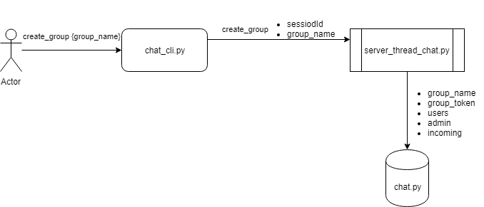

## Final Project Network Programming 2019

### Member
- Faizal Khilmi Muzakki 05111640000120
- Marde Fasma Ul'Aza 05111640000046
- M Hazdi Kurniawan 05111640000072

### Assignment Description
- Implementasikan code bapaknya
- Tambah fitur:
    - Logout
    - Group chat
    - Send file/image
- Implementasikan juga GUI
- Nggak harus sampai selesai, yang penting progress, hehe (( diusahakan ))

### Protocol
#### User => user
- `auth [username] [password]`

- `send [username_to] [message]`

- `inbox`

- `send_file [username_to] [filename]`

- `download_file [filename]`

- `logout`

#### User => group
- `create_group [group_name]`

- `join_group [group_token]`

- `send_group [group_token] [message]`

- `inbox_group [group_token]`

- `leave_group [group_token]`

